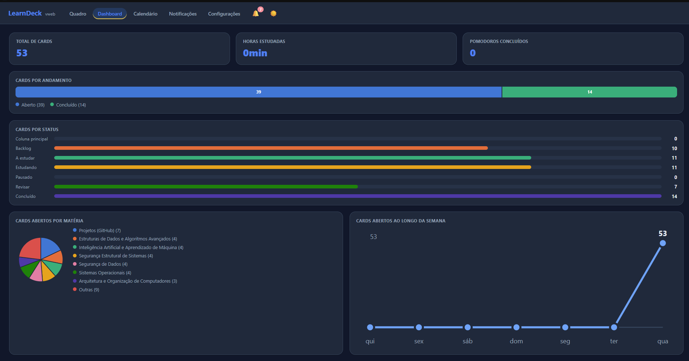
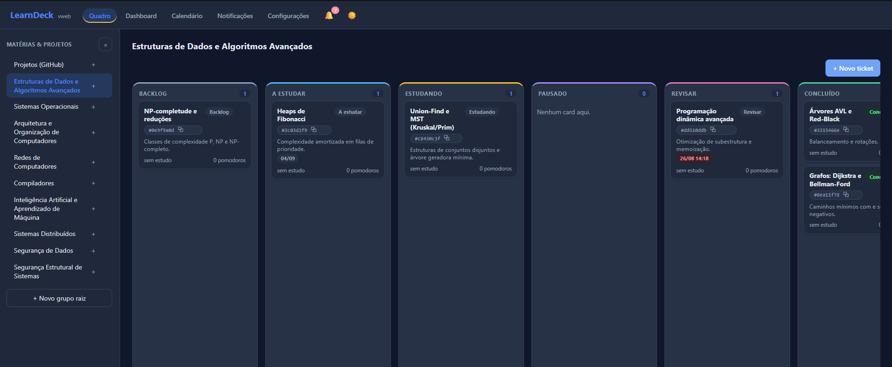
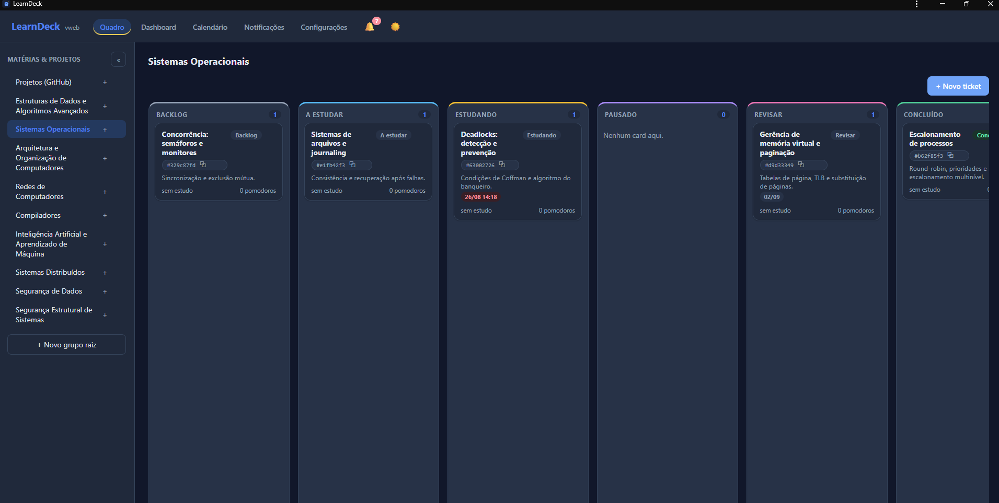
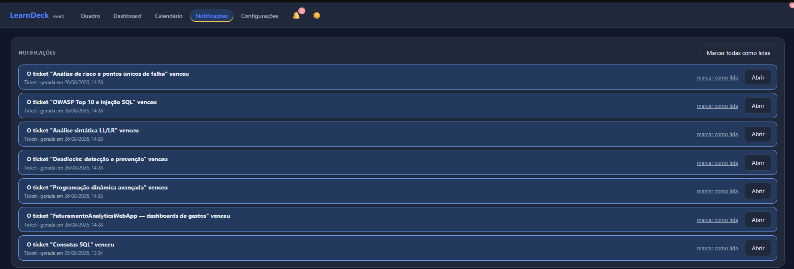
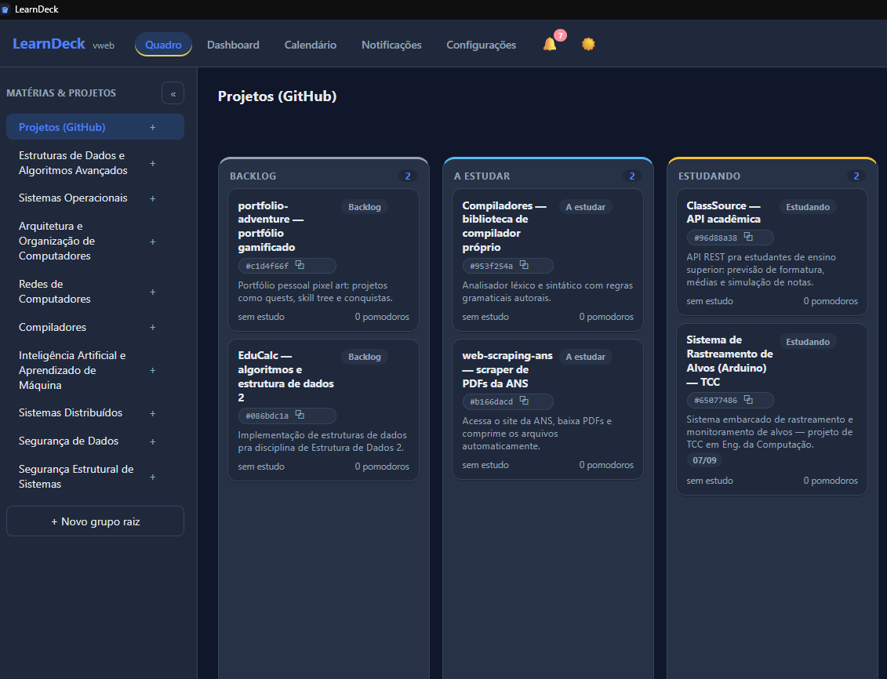
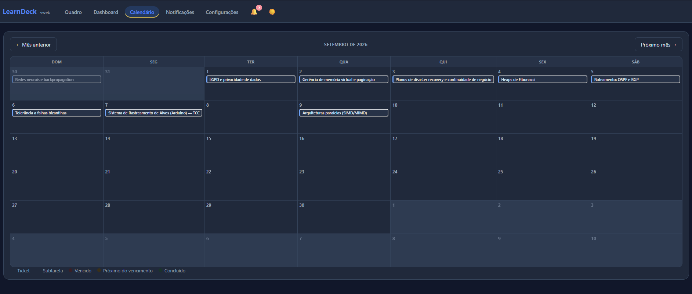

# 📚 LearnDeck


> ### 🌐 Testar agora: **<https://matheus-emanoel-souza.github.io/LearnDeck/>**
>
> Roda direto no navegador, no celular ou no PC, sem instalar nada — e dá para adicionar à tela
> inicial e usar como app (PWA).
>
> Os dados ficam salvos no próprio dispositivo (SQLite via IndexedDB), então **não há
> sincronização** entre celular, PC e a versão desktop: cada um tem seus próprios dados.

Aplicativo desktop **local e offline** para gerenciar estudos através de cards, inspirado no
funcionamento de sistemas de tickets (estilo TiFlux), mas voltado para acompanhamento de
aprendizado, tempo de estudo e produtividade.

Organize seus estudos em grupos hierárquicos (`Faculdade > Cálculo > Integrais`), mova cards
entre colunas de um quadro Kanban totalmente **customizável** (crie, renomeie, reordene e
colora as colunas do seu jeito), cronometre suas sessões de estudo, use Pomodoro configurável,
relacione cards entre si (ex.: "Estudar derivadas" como pré-requisito de "Estudar integrais"),
anexe arquivos, defina prazos e subtarefas, acompanhe vencimentos no calendário e na central de
notificações, e veja tudo num dashboard com números e gráficos.

> ✅ MVP completo (Fases 0 a 9) + Fase 10 (colunas dinâmicas, anexos, prazos, subtarefas,
> notificações). Ver histórico em [`docs/roadmap.md`](docs/roadmap.md) e o que já existe vs. o
> que falta em [`docs/features.md`](docs/features.md).
>
> 🌐 Nesta branch (`webapp`) existe também uma versão que roda direto no navegador, sem instalar
> nada (PWA) — `npm run dev:webapp` / `npm run build:webapp`. Ver [`docs/WEBAPP.md`](docs/WEBAPP.md).

---

## 📸 Capturas de tela

| Dashboard | Quadro Kanban |
|---|---|
|  |  |

| Vários quadros (matérias e projetos) | Notificações de prazo vencido |
|---|---|
|  |  |

| Projetos do GitHub como tickets | Calendário de prazos |
|---|---|
|  |  |

---

## 📋 Índice

- [Objetivo do projeto](#-objetivo-do-projeto)
- [Como funciona](#-como-funciona)
- [Funcionalidades](#-funcionalidades)
- [Pré-requisitos](#️-pré-requisitos)
- [Como rodar em desenvolvimento](#-como-rodar-em-desenvolvimento)
- [Como gerar o instalador (build)](#️-como-gerar-o-instalador-build)
- [Arquitetura](#-arquitetura)
- [Estrutura de pastas](#-estrutura-de-pastas)
- [Tecnologias utilizadas](#️-tecnologias-utilizadas)
- [Documentação adicional](#-documentação-adicional)
- [Licença](#-licença)

---

## 🎯 Objetivo do projeto

Organizar meus estudos através de cards, acompanhar quanto tempo é investido em cada assunto e
analisar a evolução através de métricas (horas estudadas, Pomodoros realizados, cards
concluídos, etc.) — tudo rodando **100% localmente**, sem servidor externo e sem depender de
internet para o uso do dia a dia (a internet só entra em cena para checar atualizações do
próprio app).

## 🧭 Como funciona

1. **Grupos** — crie matérias/projetos hierárquicos na barra lateral (ex.: `Faculdade > Cálculo
   > Integrais`), quantos níveis quiser.
2. **Cards** — dentro de um grupo, crie cards de estudo (título + descrição opcional, prazo
   opcional). Todo card nasce na primeira coluna do quadro.
3. **Quadro Kanban** — colunas **dinâmicas**, definidas por você: crie, renomeie, reordene
   (arraste o cabeçalho), colora, duplique ou exclua (só se vazia) pelo botão direito no
   cabeçalho da coluna. Arraste os cards entre colunas ou reordene dentro da mesma coluna — toda
   troca fica registrada no histórico do card. Cada card tem um botão **⋮** no canto que abre um
   menu rápido: Novo apontamento, Enviar comunicação, Agrupar ticket, Abrir ticket filho (atalhos
   para o que já existe na tela do card — item 4).
4. **Tela do card** — clicar num card abre uma **tela inteira** dedicada a ele (não um modal),
   com:
   - descrição editável, tags e comentários;
   - histórico de mudanças de status;
   - **cronômetro** para iniciar/parar sessões de estudo (uma sessão aberta por vez);
   - **Pomodoro configurável** (foco/pausa curta/pausa longa/ciclos) — um ciclo de foco conta
     automaticamente como uma sessão de estudo;
   - lista das sessões de estudo anteriores;
   - **cards relacionados** (pré-requisito, bloqueia, relacionado, parte de), com busca por
     título ou seleção por lista completa do workspace, e navegação direta entre cards ligados;
   - **arquivos anexados** (selecionar, abrir com o programa padrão, remover);
   - **prazo** (data + hora) e **subtarefas** (com prazo próprio e marcação de concluída);
   - aba **Caderno**: documentação técnica em Markdown com editor visual, separada dos
     apontamentos (que continuam sendo o histórico cronológico).
5. **Calendário e notificações** — visão mensal de prazos (cards e subtarefas) com clique
   abrindo o card correspondente, e uma central de notificações com alertas de vencimento
   (deduplicados, marcáveis como lidos).
6. **Dashboard** — aba separada com a quantidade de cards abertos/em andamento/concluídos, horas
   totais estudadas, Pomodoros concluídos, gráfico de pizza (cards por matéria) e gráfico de
   linha (cards abertos ao longo da semana).
7. **Configurações** — tela dedicada com verificação manual de atualizações.
8. **Instalador e atualizações** — o app é distribuído como um instalador `.exe` autocontido, com
   ícone próprio; uma vez instalado, ele mesmo verifica e baixa novas versões pela internet
   (GitHub Releases) e avisa quando estiver pronto para reiniciar e aplicar a atualização.

## ✅ Funcionalidades

Ver estado detalhado em [`docs/features.md`](docs/features.md) e o histórico completo em
[`docs/roadmap.md`](docs/roadmap.md).

- Grupos hierárquicos (matérias/projetos/subassuntos)
- Cards com título, descrição, coluna, tags, comentários, prazo e histórico de mudanças
- Quadro Kanban visual com **colunas dinâmicas** (criar/renomear/reordenar/colorir/duplicar/
  excluir) e drag-and-drop de cards
- Menu de ações do card (⋮): Novo apontamento, Enviar comunicação, Agrupar ticket, Abrir ticket
  filho
- Tela inteira dedicada a cada card (não modal)
- Cronômetro individual por card, com sessões de estudo registradas
- Pomodoro configurável, vinculado a cada card e ao cronômetro
- Relacionamentos entre cards (pré-requisito, bloqueia, relacionado, parte de), com busca ou
  seleção por lista no workspace inteiro
- Anexos, prazos (card e subtarefa), subtarefas, calendário e central de notificações de atraso
- **Caderno do card**: documentação técnica em Markdown com editor visual (MDXEditor) — modo
  visual e Markdown, modelos (em branco/técnico), imagens via anexo, blocos de informação/aviso/
  erro/sucesso, seção recolhível, fórmulas (KaTeX), diagramas (Mermaid), gráficos, palavras-chave
  `#tag`, link entre cards, comandos `/`, autosave com histórico de versões
- Dashboard com contagens por status, horas estudadas, Pomodoros e gráficos (pizza por matéria,
  linha por semana)
- Tela de Configurações com verificação manual de atualizações
- Layout em paleta lavanda/roxo, estilo app de estudos
- Instalador `.exe` para Windows, com ícone próprio, funcionando totalmente offline, com
  atualização automática via internet (GitHub Releases)

## ⚙️ Pré-requisitos

| Ferramenta | Versão usada |
|---|---|
| Node.js | 20+ (testado com 22) |
| npm | 10+ |
| Windows | 10/11 x64 (alvo do instalador) |

## 🚀 Como rodar em desenvolvimento

```bash
git clone https://github.com/Matheus-Emanoel-Souza/LearnDeck.git
cd LearnDeck
npm install
npm run dev
```

Isso abre a janela do Electron com hot-reload no processo renderer. O banco SQLite é criado
automaticamente em `%APPDATA%\LearnDeck\learndeck.db` no primeiro boot.

### Outros scripts

```bash
npm run typecheck   # checa os três tsconfig (main, preload, renderer)
npm run lint        # ESLint
npm run test         # testes unitários (Vitest)
npm run build        # build de produção (sem empacotar instalador)
npm run dist          # build + gera o instalador .exe em dist/
```

## 🏗️ Como gerar o instalador (build)

```bash
npm run dist
```

Gera `dist/LearnDeck-Setup-<versão>.exe` via `electron-builder` (NSIS), self-contained —
não exige Node/Electron pré-instalado na máquina do usuário final, seguindo o mesmo princípio
usado no [RadarTorres](https://github.com/Matheus-Emanoel-Souza/Sistema_Rastreamento_Alvos_Arduino).

Para que a **atualização automática** funcione de fato, a versão precisa ser publicada como uma
*release* no GitHub (`electron-builder.yml` já aponta o `publish` para este repositório) — isso
exige rodar o build com um `GH_TOKEN` configurado, publicando os artefatos gerados.

## 🏛️ Arquitetura

Visão completa em [`docs/architecture.md`](docs/architecture.md). Resumo:

- **Electron** com `contextIsolation` ligado — o renderer (React) nunca acessa Node/SQLite
  diretamente, só através de uma API tipada exposta pelo `preload` via IPC.
- **Toda regra de negócio vive no processo main** (`src/main/services`), com acesso a dados
  isolado em repositórios (`src/main/repositories`).
- **SQLite local** (`better-sqlite3`), sem servidor, sem ORM pesado — SQL explícito e
  auditável, com migrations versionadas em `src/main/db/migrations`.
- **Campos desnormalizados** (`total_study_seconds`, `pomodoros_completed`) em `cards`, sempre
  recalculados a partir de `study_sessions`/`pomodoros` — fonte da verdade continua nas tabelas
  de log.

## 📁 Estrutura de pastas

```text
LearnDeck/
├── docs/                # Arquitetura, banco de dados, decisões, roadmap
├── src/
│   ├── main/            # Processo principal: DB, migrations, repositórios, services, IPC, updater
│   ├── preload/          # Ponte segura entre main e renderer (contextBridge)
│   ├── renderer/          # App React (Kanban, dashboard, tela do card, etc.)
│   └── shared/             # Tipos TypeScript compartilhados entre as camadas
├── build/                    # Ícones/assets do instalador
├── electron.vite.config.ts
├── electron-builder.yml
└── package.json
```

Detalhes completos em [`docs/architecture.md`](docs/architecture.md).

## 🛠️ Tecnologias utilizadas

- [Electron](https://www.electronjs.org/) + [electron-vite](https://electron-vite.org/)
- [React 18](https://react.dev/) + TypeScript
- [better-sqlite3](https://github.com/WiseLibs/better-sqlite3)
- [electron-builder](https://www.electron.build/) (empacotamento `.exe`)
- [electron-updater](https://www.electron.build/auto-update) (atualização automática via GitHub
  Releases)
- [MDXEditor](https://mdxeditor.dev/) + [mermaid](https://mermaid.js.org/) +
  [KaTeX](https://katex.org/) + [Recharts](https://recharts.org/) (Caderno do card — editor
  Markdown visual, diagramas, fórmulas e gráficos)
- [Vitest](https://vitest.dev/) (testes unitários)

## 📖 Documentação adicional

- [`docs/architecture.md`](docs/architecture.md) — arquitetura, processos do Electron, fluxo de dados
- [`docs/database.md`](docs/database.md) — schema completo do SQLite
- [`docs/decisions.md`](docs/decisions.md) — decisões técnicas e alternativas descartadas
- [`docs/features.md`](docs/features.md) — funcionalidades implementadas vs. pendentes
- [`docs/roadmap.md`](docs/roadmap.md) — plano de desenvolvimento incremental

## 📄 Licença

MIT
