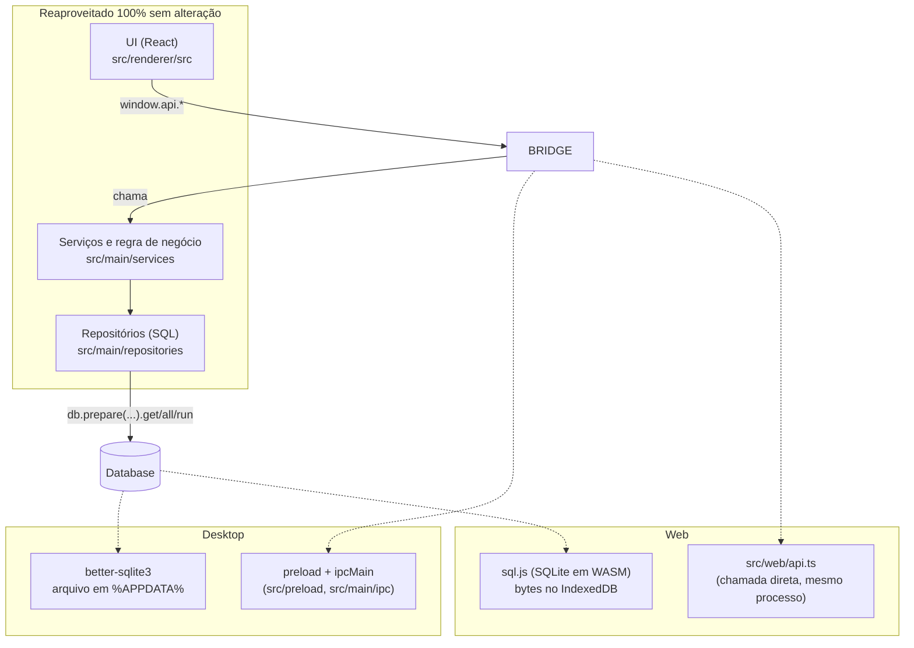

# Build web (PWA) — sem instalar nada

Branch `webapp`: acrescenta uma segunda forma de rodar o LearnDeck, direto no navegador, sem Electron, sem instalador. A versão desktop (`npm run dev` / `npm run dist`) continua exatamente igual — nenhum arquivo de `src/main`, `src/preload` ou `electron.vite.config.ts` foi alterado (só 1 componente do renderer ganhou um hook opcional, ver "O que foi tocado no código existente").

## Como rodar

```bash
npm install
npm run dev:webapp     # dev server, abre em http://localhost:5173
npm run build:webapp   # gera out-web/ (estático, hospedável em qualquer lugar)
```

`build:webapp` roda `tsc --noEmit` antes de empacotar — mesma disciplina do `npm run build` do desktop.

## Ideia geral

O app tem 3 camadas: **UI** (React, `src/renderer`), **regra de negócio** (`src/main/services`), **acesso a dado** (`src/main/repositories`, tudo em cima de `db.prepare(sql).get/all/run(...)`). Nenhuma dessas camadas importa Electron — só os arquivos de `src/main/ipc/*` e `src/preload` fazem a ponte `renderer -> ipcMain -> SQLite`.



A UI só conhece `window.api.*` — nunca importa Electron nem SQLite diretamente. Isso é o que torna a segunda versão possível sem reescrever telas: o desktop monta `window.api` com `ipcRenderer.invoke(...)`; o web monta o mesmo objeto chamando os serviços diretamente, no mesmo processo (sem IPC porque não há processo separado).

## O que existe só no build web (`src/web/`)

| Arquivo | Papel |
|---|---|
| `db/sqljsDatabase.ts` | Adaptador: faz um banco sql.js responder `.prepare().get/all/run()`, `.exec()`, `.transaction()` do jeito que `better-sqlite3` responde — repositórios não percebem a troca. |
| `db/connection.ts` | Equivalente a `main/db/connection.ts`: carrega os bytes do banco do IndexedDB (ou cria um novo), roda as migrations existentes, persiste a cada escrita (debounce de 400ms). |
| `db/idbStore.ts` | IndexedDB chave/valor cru, sem dependência externa. |
| `attachmentsWeb.ts` | Equivalente a `main/services/attachmentService.ts`: sem diálogo nativo de arquivo nem disco — usa `<input type=file>` e grava o Blob no IndexedDB. |
| `notificationScannerWeb.ts` | Equivalente a `main/notificationScanner.ts`: sem `BrowserWindow`, avisa a própria aba via `EventTarget`. |
| `api.ts` | Substitui `src/preload` + `src/main/ipc/*`: monta `window.api` chamando serviços/repositórios direto. |
| `main.tsx`, `index.html`, `public/` | Bootstrap do PWA (manifest, service worker, ícone). |

## O que foi tocado no código existente

- `src/renderer/src/components/notebook/CardNotebook.tsx`: 4 linhas a mais — um `useEffect` que só roda se `isWebBuild()` for verdadeiro (sempre falso no Electron). Resolve imagens do caderno (ver limitação abaixo).
- Novo `src/renderer/src/lib/platform.ts`, `attachmentImageResolver.ts`, `attachmentBlobStore.ts` — usados só pelo build web, mas moram no renderer compartilhado porque também rodam no Chromium do Electron (não fazem nada lá, o gate é o `isWebBuild()`).

Todo o resto — telas, componentes, tipos, migrations, regra de negócio — é o **mesmo arquivo, sem cópia**, usado pelos dois builds.

## Persistência e segurança

Mesmo raciocínio do documento [`FUNCIONAMENTO.md`](./FUNCIONAMENTO.md) do outro projeto: nada sai do aparelho. O "banco" e os anexos ficam no IndexedDB do navegador, isolado por origem — só esse site enxerga esses dados, e nenhum passa por rede.

**Limitação real, sem enfeitar:** ao contrário do desktop (arquivo em `%APPDATA%`), o build web **não tem exportação/backup ainda**. Limpar dados do site/navegador apaga tudo. Antes de divulgar a versão web pra uso sério, vale portar a ideia de backup do outro projeto (exportar/importar um JSON) — não existe no LearnDeck hoje, nem no desktop.

## Limitações conhecidas do build web

- **Sem auto-update**: `electron-updater` não existe fora do Electron; a aba "Configurações" mostra estado `unsupported`.
- **Imagens do caderno**: são salvas como `ldattach://cardId/attachmentId` (mesmo formato do desktop, pra manter o Markdown portátil). O navegador não resolve esse esquema sozinho, então `attachmentImageResolver.ts` troca o `src` por uma URL de Blob assim que a imagem entra na tela — pode haver um flash antes de carregar.
- **Sem backup** (ver acima).
- **Um IndexedDB por navegador/dispositivo** — não sincroniza entre abas de navegadores diferentes nem entre desktop e web.

## Instalável como atalho (opcional)

Igual ao outro projeto: manifest + service worker deixam o navegador oferecer "instalar/adicionar à tela inicial". É só um atalho — o app funciona igual sem isso, direto do link.
